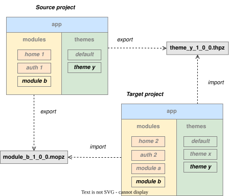

.. Pigal-Flask documentation master file, created by
   sphinx-quickstart on Sun Nov 30 20:04:08 2025.
   You can adapt this file completely to your liking, but it should at least
   contain the root `toctree` directive.

Pigal-Flask
===========

*Pigal-Flask* is a Flask extension that simplifies the collaborative development of **web portal projects** 
that facilitate the management of online information and activities for any organisation.
Indeed Pigal-Flask helps web developpers to collaborate using following conventions and best practices:

* **modular monolith architecture** of web projects
* **optional File-based Routing** for web interface
* **Role-Based Access Control** for the security
* **Reusable and shareable themes** for frontend
* **Internationalisation** native support

Basic concepts
--------------

A **project** is a web portal project. It has a modular architecture based on 03 components:

* **app** which provide configuration and Flask extensions
* **modules** which provide specific domain frontends, backends and databases
* **themes** which provide global themes and styling for modules frontends

.. image:: ../diagrams/pigal_project_architecture.drawio.svg

In any project, there is two specialized modules:

* **home** which provide home frontend and backend
* **auth** which handle authentification and authorization

Any module contains:

* **pages** which provides html UI through app
* **services** which provides Rest API to clients
* **static** which contains static resources

.. image:: ../diagrams/pigal_module_structure.drawio.svg

Pages use themes for their design. Each theme contains:

* **layouts** which help to structure pages with Jinja templates
* **macros** which help to create pages components with Jinja macros
* **static** which provides static files (images, styles, ...)

.. image:: ../diagrams/pigal_theme_structure.drawio.svg

Web developpers can collaborate by exchanging modules or themes. 
From a project, a module can be exported as ``.mopz`` files then imported in another project. 
Similarly, a theme can be exported as ``.thpz`` files then imported in another project.

With this architecture, *Pigal-Flask* aims to provide the following benefits:

* **easier collaboration**: developers can easily collaborate with parts of project
* **easier scalability**: developers can easily add and remove features to projects
* **easier maintainability**: projects can easily be maintained, tested and refactored

Installation
------------

Use the following command to install ``Pigal-Flask`` extension:

.. code-block:: bash

    pip install Pigal-Flask

Quickstart
----------

.. toctree::
   :maxdepth: 1

   basic_projects
   basic_modules
   basic_frontends
   basic_backends
   basic_databases
   sharing_modules
   sharing_themes

Advanced functionnalities
-------------------------

.. toctree::
   :maxdepth: 1

   advanced_rbac
   advanced_home
   advanced_auth
   advanced_extensions
   advanced_databases
   advanced_themes

API Reference
-------------

.. toctree::
   :maxdepth: 1

   api_commands
   api_views
   api_extensions
   api_utils
   api_exceptions

Indices and tables
------------------

* :ref:`genindex`
* :ref:`modindex`
* :ref:`search`

