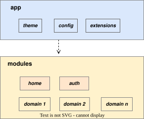
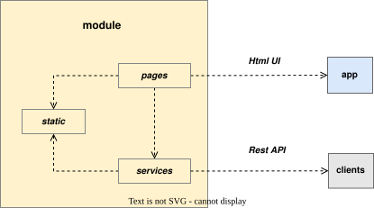
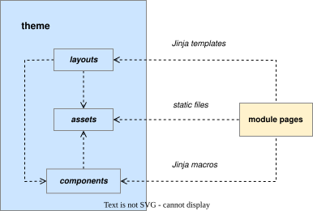
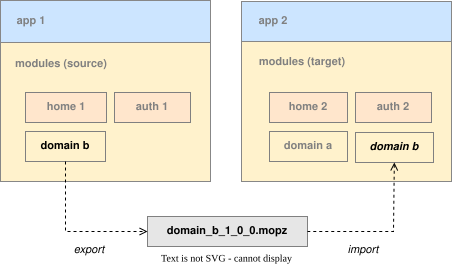
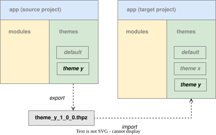

.. Pigal-Flask documentation master file, created by
   sphinx-quickstart on Sun Nov 30 20:04:08 2025.
   You can adapt this file completely to your liking, but it should at least
   contain the root `toctree` directive.

Pigal-Flask
===========

*Pigal-Flask* is a Flask extension that simplifies the collaborative development of **web portal projects** 
that facilitate the management of online information and activities for any organisation.
Indeed Pigal-Flask helps web developpers to collaborate using following conventions and best practices:

* **modular monolith architecture** of web projects
* **Role-Based Access Control** for the security
* **Reusable and shareable themes** for frontend
* **Internationalisation** native support

Basic concepts
--------------

A **Project** represent a web portal project. It is a ``Flask application`` with a modular architecture based on 02 components:

* **app** which provide global theme, configuration and Flask extensions
* **modules** which provide specific domain frontends, backends and databases

In any project, there is two specialized modules:

* **home** which provide home frontend and backend
* **auth** which provide authentification and authorization fonctionnalities

A **module** represent a domain. It is a ``Flask blueprint`` which provides:

* a **Web UI** made of web pages and provides by ``controllers`` to client browser
* a **Public API** provides by ``services`` to any other modules within project
* a **Rest API** provides by ``ressources`` to any external client

A module contains also:

* ``pages`` which contains jinja templates
* ``assets`` which contains static files
* ``models`` which contains databases models and entities

Module pages use the global **theme** provided by app for their design:

A theme provides:

* **layouts** of pages as Jinja templates
* **components** of pages as Jinja macros
* **assets** for page styling with static files (imgs, csv, ...)

With this architecture, *Pigal-Flask* aims to provide the following benefits:

* **easier collaboration**: frontend and backend developers can easily collaborate
* **easier scalability**: developers can easily add and remove features to projects
* **easier maintainability**: projects can easily be maintained, tested and refactored

Indeed, web developpers can collaborate by exchanging modules. 
from a project, A **module** can be exported as ``.mopz`` files then imported in another project.
this allow flexible collaboration between or within teams of developpers.

Frontend developpers can create and publish themes. 
A theme is published by exporting it as ``.thpz`` files from a project. 
Then any other developper can import this theme in his project.

Installation
------------

Use the following command to install ``Pigal-Flask`` extension:

.. code-block:: bash

    pip install Pigal-Flask

Quickstart
----------

.. toctree::
   :maxdepth: 1

   basic_projects
   basic_modules
   basic_frontends
   basic_backends
   basic_databases
   sharing_modules
   sharing_themes

Advanced functionnalities
-------------------------

.. toctree::
   :maxdepth: 1

   advanced_rbac
   advanced_home
   advanced_auth
   advanced_extensions
   advanced_databases
   advanced_themes

API Reference
-------------

.. toctree::
   :maxdepth: 1

   api_commands
   api_extensions
   api_utils
   api_exceptions

Indices and tables
------------------

* :ref:`genindex`
* :ref:`modindex`
* :ref:`search`

